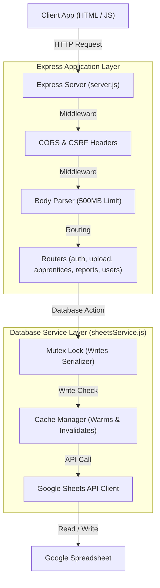
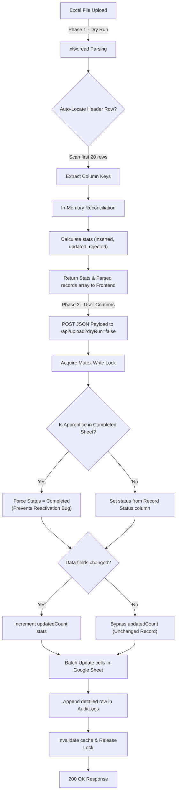
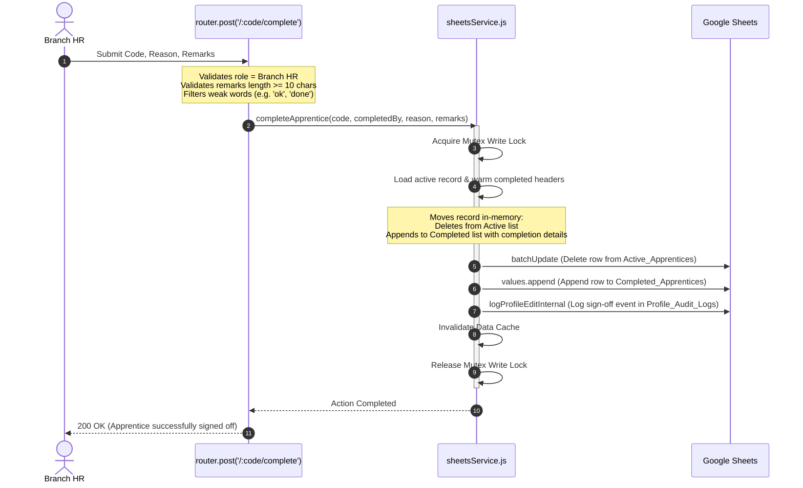

# PGP Glass Apprentice Portal - Full System Documentation

Welcome to the comprehensive system documentation for the **PGP Glass Apprentice Portal**. This document covers every layer of the system from the frontend UI flow to the backend Express configuration, Google Sheets database mapping, and core logic engines.

---

## 1. Technical Stack Overview

The portal is designed as a lightweight, secure, and highly responsive web application:
* **Frontend**: Single Page Application (SPA) structure using semantic HTML5, Vanilla JavaScript (ES6+), and premium custom Vanilla CSS styling (incorporating variable-driven CSS tokens, glassmorphism UI, a responsive flex/grid system, and dynamic light/dark modes).
* **Backend**: Node.js & Express REST API server.
* **Database**: Google Sheets Spreadsheet (utilizing Google Sheets API v4), acting as a serverless database with cache warming, writes serialization, and in-memory caches.

---

## 2. Frontend Architecture & Flow

The frontend files are located in the root directory and the `pages` and `assets` directories:

### Directory Structure:
* `/index.html`: main entry point (handles user authentication & redirection).
* `/pages/`:
  * `dashboard.html`: KPI overview, charts (Chart.js), and historical activity logs.
  * `apprentices.html`: Active and completed apprentice registry grids.
  * `apprentice-detail.html`: Individual apprentice profile page with demographic details, audit timeline logs, and Branch HR sign-off controls.
  * `upload.html`: Importer center for Excel sheet validation, dry runs, and commits.
  * `analytics.html`: Interactive charts showcasing apprentice demographics, intakes, and distributions.
  * `reports.html`: Custom column report builder and exporter (CSV, Excel, PDF).
  * `users.html`: User account management console.
  * `settings.html`: System & notification preferences.
* `/assets/js/app.js`: Unified frontend application controller containing page logic, routing, cache storage, and backend API request handlers.
* `/assets/css/`: Vanilla CSS files (e.g. main layout, components, sidebar, and dashboard stylesheets) containing visual design tokens, smooth animations, and layout grids.

### Core Frontend Components:
1. **AppDB Manager (`app.js`)**: Communicates with the backend, stores JWT sessions, manages Local Storage caching for rapid loading, and handles role-based authorization.
2. **ModalManager (`app.js`)**: Customized premium dialog modal manager for confirmations (e.g. logging out, deleting users, marking completions, and verifying successful imports).
3. **Toast Manager (`toast.js`)**: Lightweight notification popup alert system for errors, warnings, info, and successes.
4. **ExcelUploadPage (`app.js`)**: Controls the drag-and-drop spreadsheet zone, handles dry-run rendering, calculates unchanged rows, and POSTs the cached validation JSON to the server.
5. **ReportsPage (`app.js`)**: Fetches active/completed headers dynamically, maintains column selections in Local Storage (`pgp_cols_active`, `pgp_cols_completed`, `pgp_cols_master`), and handles CSV/Excel/PDF exports.

---

## 3. Backend Architecture & Services

The backend code is situated in the `/backend` folder:



### Concurrency and Cache Control ([sheetsService.js](file:///g:/PGP_GLASS_Apprentice_portal%20new/PGP_GLASS_Apprentice_portal/backend/services/sheetsService.js))
* **Mutex Serializer**: A custom `Mutex` class that wraps all spreadsheet writes. All operations that modify rows must acquire this lock, serializing write requests and completely preventing concurrent writing conflicts or race conditions.
* **In-Memory Caching**: To avoid hitting Google Sheets API quotas, read operations use an in-memory cache:
  * **TTL (Time To Live)**: `Active` & `Completed` lists = 5 min, `AuditLogs` = 60s, `Users` = 5 min.
  * **Background Refreshes**: If a cache is warm but approaching its TTL, a background refresh is triggered asynchronously, warming the cache without blocking the active user request.
  * **Invalidation Triggers**: Write operations immediately invalidate relevant caches to ensure subsequent reads load fresh data.

### Middleware Layer
* **Security Headers**: Custom security headers set via middleware on every response:
  * `X-Content-Type-Options: nosniff` (prevents MIME type sniffing)
  * `X-Frame-Options: SAMEORIGIN` (prevents clickjacking)
  * `Content-Security-Policy` (limits script/style source execution to self & verified CDNs)
* **CORS Config**: Strictly limits cross-origin resource sharing to localhost, internal network ranges, and approved production deployment domains.
* **High-Limit Body Parsers**: Express JSON and urlencoded parsers are configured with a limit of **`500mb`** in [server.js](file:///g:/PGP_GLASS_Apprentice_portal%20new/PGP_GLASS_Apprentice_portal/backend/server.js) to prevent body parser crashes when large validated record payloads are sent for database commits.

---

## 4. Google Sheets Database Schema

The database consists of 5 sheets inside the Google Spreadsheet:

1. **`Users`**:
   * Columns: `UserID`, `Name`, `Email`, `PasswordHash`, `Role`, `Location`, `Status`, `CreatedDate`.
2. **`Active_Apprentices`**:
   * Columns: `Employee Code` (Primary Key), `Full Name`, `Location`, `Department`, `Joining Date`, `Sex`, `Age`, `Phone`, `Email`, `Address`, `Remarks`, `Employee Contract ID`, `Portal Enrollment Number`, `Portal Name`, `Record Status`, `Updated By`, `Updated Date`.
3. **`Completed_Apprentices`**:
   * Columns: Same as Active but replaces `Record Status`, `Updated Date`, and `Updated By` with completion details: `Completion Date`, `Completed By`, `Completion Reason`, `Other Completion Reason`, `Completion Remarks`.
4. **`AuditLogs`**:
   * Columns: `Upload Time`, `Uploaded By`, `File Name`, `Inserted`, `Updated`, `Rejected`, `Duplicates Removed`, `New Columns Created`, `Execution Duration`.
5. **`Profile_Audit_Logs`**:
   * Columns: `Timestamp`, `Employee Code`, `Employee Name`, `Updated By`, `Action`, `Changes`.

---

## 5. Core Logic Engines

### A. Excel Upload & Reconciliation Engine
A two-phase transaction workflow that parses a file (Phase 1 - Dry Run) and commits the cached list via JSON (Phase 2 - Commit):



#### Key Reconciliation Rules:
* **Case-Insensitive Identifiers**: Matches incoming records against database records using Employee Code first, falling back to Employee Contract ID or Portal Enrollment Number (ignoring case and spaces).
* **Reactivation Prevention**: If an apprentice is already in the completed list (`Completed_Apprentices`), they are locked as Completed. They cannot be reactivated or moved back to the active sheet by subsequent Excel uploads.
* **Precise Updates Calculation**: Compares each incoming field (excluding timestamps/metadata) against existing records. The `updatedCount` increments **only** if actual demographic or status changes occurred.
* **Manual HR Fields Preservation**: Retains existing database values for fields manually tracked by HR (Contract ID, Enrollment Number, Portal Name, Remarks) if they are already populated and the Excel sheet has them blank or set to "Pending".

---

### B. Completion Sign-Off Engine
Managed in [routes/apprentices.js](file:///g:/PGP_GLASS_Apprentice_portal%20new/PGP_GLASS_Apprentice_portal/backend/routes/apprentices.js):



#### Completion Rules:
1. **Branch HR Only**: Only users with the **Branch HR** role can sign off on completions.
2. **Location Locking**: HR managers can only sign off on apprentices located at their designated branch.
3. **Quality-Controlled Remarks**: Remarks must be at least 10 characters long and cannot consist of weak words (e.g. `ok`, `done`, `n/a`, `test`).
4. **Transition Log**: Deletes the apprentice row from `Active_Apprentices`, appends to `Completed_Apprentices` with details, and logs the sign-off event in `Profile_Audit_Logs`.

---

### C. Report Builder & Custom Columns Exporter
Managed in [routes/reports.js](file:///g:/PGP_GLASS_Apprentice_portal%20new/PGP_GLASS_Apprentice_portal/backend/routes/reports.js) and [reportService.js](file:///g:/PGP_GLASS_Apprentice_portal%20new/PGP_GLASS_Apprentice_portal/backend/services/reportService.js):
* **Zero-Records Dynamic Discovery**: If the database contains zero apprentice records, column discovery does not crash. It retrieves the headers directly from the first row of the cached Google Sheet (`getActiveHeaders()` / `getCompletedHeaders()`), ensuring the Reports page checkboxes render properly.
* **Filtered Exports**: Resolves the selected report type and filters, validates columns, maps headers, and compiles the report into:
  * **CSV**: Standard comma-separated values.
  * **Excel**: A binary workbook styled using the `xlsx` package.
  * **PDF**: Compiled using `pdfkit`. Automatically formats columns and limits grid widths to the 9 most important fields to fit the page and maintain readability.

---

### D. Historical Import Logs Normalization
To prevent `N/A` or `Unknown` values in the UI import logs history, the `getUploadAuditLogs()` reader includes a dynamic normalization mapper:
* **Old Format Mapping**: Translates historical sheet headers (`Timestamp`, `User`, `Filename`, `Rows Inserted`, etc.) into the unified standard keys expected by the frontend.
* **Mismatched Row Alignment**: Automatically aligns misaligned cells (written by newer code into older columns before restructuring) based on execution duration formats.
* **Unified Output**: Assures all logs from any period render completely with correct file names, usernames, and record counts.

---

## 6. Role Permissions Matrix

The portal enforces strict role-based access control (RBAC):

| Feature / Page | Super HR Admin | Branch HR (Kosamba/Halol/Jambusar) |
| :--- | :---: | :---: |
| **Scope of Data** | Company-wide (All locations) | Restrictive (Own location only) |
| **Topnav Branch Selector** | 🟢 Enabled (Can switch views) | 🔴 Disabled (Locked to own branch) |
| **Registry View & Search** | 🟢 Can view all apprentices | 🟢 Can only view own branch apprentices |
| **Edit Profile Details** | 🟢 Can edit all details (Active only) | 🟢 Can edit own branch details (Active only) |
| **Spreadsheet Imports** | 🟢 Full Import Access | 🔴 Access Denied (HTTP 403) |
| **User Account Management** | 🟢 Full Access | 🔴 Access Denied (HTTP 403) |
| **Analytics Dashboard** | 🟢 Full Access | 🔴 Access Denied (HTTP 403) |
| **Mark Completion** | 🔴 Access Denied (HR Leads only) | 🟢 Allowed for own branch apprentices |
| **Custom Report Export** | 🟢 Company-wide or by branch | 🟢 Locked to own branch data |

---

## 7. Setup & Execution Guide

### Prerequisites
* Node.js (v18 or higher recommended)
* A Google Cloud Project with the Google Sheets API enabled and a Service Account key downloaded as JSON.

### Step 1: Set up Environment Config
Create a `.env` file in the `backend` folder:
```ini
PORT=3001
NODE_ENV=production
JWT_SECRET=your_secure_random_jwt_secret_key_2026
SPREADSHEET_ID=your_google_spreadsheet_id_here
GOOGLE_APPLICATION_CREDENTIALS=./config/service-account.json
```

Place your Google Service Account key in:
`backend/config/service-account.json`

### Step 2: Seed the Database
Open a terminal in the `backend` folder, install backend packages, and seed the initial HR accounts into your Google Sheet:
```powershell
cd backend
npm install
npm run seed
```

### Step 3: Start the Backend Server
```powershell
npm start
```
The server will start on port `3001`.

### Step 4: Start the Frontend Web Server
Open a new terminal in the project root directory and run:
```powershell
npx http-server -p 8080
```
Open your browser to **`http://localhost:8080`** to log in.

### Default Credentials:
* **Super HR Admin:** `super.hr@pgpglass.com` (Password: `PGP@2024`)
* **Kosamba Branch HR:** `kosamba.hr@pgpglass.com` (Password: `PGP@2024`)
* **Halol Branch HR:** `halol.hr@pgpglass.com` (Password: `PGP@2024`)
* **Jambusar Branch HR:** `jambusar.hr@pgpglass.com` (Password: `PGP@2024`)
