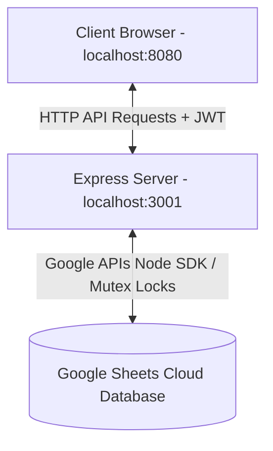
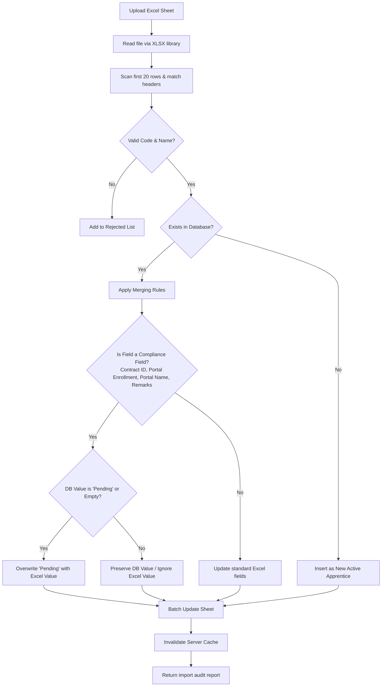

# PGP Glass Apprentice Portal

The **PGP Glass Apprentice Portal** is a secure, centralized management and analytics application designed to track and coordinate apprentice profiles, training completions, and regulatory compliance (NAPS/NATS enrollment) across multiple factory branches (Kosamba, Jambusar, Halol, Vadodara).

The application integrates directly with a **Google Sheets database** using the Google Sheets API v4, serving as a cloud database backend with caching, concurrency control, and schema validation.

---

## 🛠️ Technology Stack

### **Frontend**
* **Core:** Standard HTML5 and Vanilla ES6 JavaScript (Single Page App style views).
* **Styling:** Vanilla CSS3 featuring variable-driven CSS tokens, glassmorphism UI, a responsive flex/grid system, and dynamic light/dark modes.
* **Visualization:** Chart.js integration for real-time compliance, monthly intakes, and branch metrics.
* **Hosting/Serving:** Served locally via `http-server` on port `8080`.

### **Backend**
* **Framework:** Node.js & Express REST API.
* **Security:** JSON Web Token (JWT) stateless authorization, rate limiters for exports/uploads, and custom security headers middleware.
* **API Client:** Google APIs Client Library (`googleapis`) for spreadsheet interactions.
* **Concurrency:** Serialized operations using custom Mutex locks on database writes.
* **Caching:** In-memory server cache system (5-minute TTL) with write-invalidation to reduce Google API usage.
* **Execution:** Hosted on port `3001` (configurable via `.env`).

---

## 📁 Project Directory Structure

```text
PGP_GLASS_Apprentice_portal/
├── index.html                    # User Authentication (Login page)
├── PGP_Glass_Portal_Documentation.html # HTML documentation view
├── FINAL_QA_REPORT.md            # Stability verification results
├── pages/                        # Frontend Application Pages
│   ├── dashboard.html            # KPI Overview, charts, and activity log
│   ├── apprentices.html          # Active and Completed apprentice registry
│   ├── apprentice-detail.html    # Profile view with edit timeline history
│   ├── upload.html               # Spreadsheet import page (Super HR only)
│   ├── analytics.html            # Analytical charts and distributions (Super HR only)
│   ├── reports.html              # Custom CSV, Excel, and PDF exports
│   ├── users.html                # User management portal (Super HR only)
│   └── settings.html             # System & notification preferences
├── assets/                       # Global Frontend Assets
│   ├── css/                      # Main, components, sidebar, and dashboard stylesheets
│   └── js/                       # Core engine scripts (app.js, charts.js, toast.js)
└── backend/                      # Node.js API Backend
    ├── server.js                 # API server entrypoint & environment validation
    ├── config/
    │   └── service-account.json  # Google Cloud Service Account Credentials
    ├── middleware/
    │   ├── auth.js               # JWT authentication middleware
    │   └── rateLimiter.js        # DDoS & API abuse rate limiters
    ├── routes/                   # API routes definitions
    │   ├── auth.js               # Login validation
    │   ├── apprentices.js        # Apprentices CRUD & mark completion
    │   ├── upload.js             # Excel file parsing and auto-reconciliation
    │   ├── users.js              # User CRUD operations
    │   └── reports.js            # PDF, Excel, and CSV report exports
    ├── services/
    │   ├── sheetsService.js      # Google Sheets client & DB synchronization
    │   ├── reportService.js      # PDFKit, XLSX sheet construction
    │   └── analyticsCache.js     # Analytics result cache manager
    ├── scripts/
    │   └── seed-users.js         # User registration database seeder
    └── package.json              # Backend dependencies & run scripts
```

---

## 🏛️ System Architecture



### **1. Core Database Configuration**
All data is stored inside a single Google Spreadsheet. The service connects to it using a Google Cloud Service Account configured in [service-account.json](file:///g:/PGP_GLASS_Apprentice_portal/backend/config/service-account.json). The sheet is partitioned into five main tabs:

* **`Users`**: Holds system user accounts (names, emails, encrypted password hashes, roles, and locations).
* **`Active_Apprentices`**: Stores the current records of active apprentices.
* **`Completed_Apprentices`**: Stores records of completed apprentices (relocated here upon completion).
* **`AuditLogs`**: Tracks Excel file upload events (timestamp, uploader, inserted/updated count).
* **`Profile_Audit_Logs`**: Tracks individual profile edits (timestamp, uploader, changed fields).

### **2. Mutex & Concurrency Control**
To prevent race conditions and write-conflicts when multiple HR managers make edits simultaneously, the backend handles writes through a centralized **Mutex Lock** queue in `sheetsService.js`. Every database modification (Insert, Update, Complete, Bulk Import) must acquire this lock, ensuring operations are serialized and written sequentially.

---

## 👥 Role Permissions Matrix

The portal enforces strict role-based access control (RBAC).

| Feature / Page | Super HR Admin | Kosamba/Halol/Jambusar Branch HR |
| :--- | :---: | :---: |
| **Scope of Data** | Company-wide (All locations) | Restrictive (Own location only) |
| **Topnav Branch Selector** | 🟢 Enabled (Can switch views) | 🔴 Disabled (Locked to own branch) |
| **Registry View & Search** | 🟢 Can view all apprentices | 🟢 Can only view own branch apprentices |
| **Edit Profile Details** | 🟢 Can edit all details (Active only) | 🟢 Can edit own branch details (Active only) |
| **Spreadsheet Imports** | 🟢 Full Import Access | 🔴 Access Denied (HTTP 403) |
| **User Account Management** | 🟢 Full Access | 🔴 Access Denied (HTTP 403) |
| **Analytics Dashboard** | 🟢 Full Access | 🔴 Access Denied (HTTP 403) |
| **Mark Completion** | 🔴 Access Denied (HR Leads only) | 🟢 Allowed for own branch apprentices |
| **Custom Report Export** | 🟢 Company-wide or by branch | 🟢 Locked to own branch data |

---

## 🔄 Excel Upload & Reconciliation Workflow

The portal features an intelligent reconciliation engine. Instead of overwriting or creating duplicate entries during spreadsheets uploads, the portal applies case-insensitive validation and preservation rules:



### **Reconciliation Merging Rules:**
* **New Apprentices:** If the "Employee Code" does not match any record in the active or completed lists, a new active apprentice record is inserted.
* **Standard Fields:** Standard details (e.g. phone, email, address, department, sex) from the Excel sheet will overwrite existing records.
* **Compliance Fields (Contract ID, Portal Enrollment Number, Portal Name, Remarks):**
  * **Rule:** If the database already holds a real value (e.g. a contract ID), the system **preserves** the database value and ignores the Excel value.
  * **Rule:** If the database currently holds `"Pending"` or is empty, the system **overwrites** it with the new value provided in the Excel sheet.

---

## ⚡ Setup & Execution Guide

### **Prerequisites**
* Node.js (v18 or higher recommended)
* A Google Cloud Project with the Google Sheets API enabled and a Service Account key downloaded as JSON.

### **Step 1: Set up Environment Config**
Create a `.env` file in the `backend` folder:
```ini
PORT=3001
JWT_SECRET=your_secure_random_jwt_secret_key_2026
SPREADSHEET_ID=your_google_spreadsheet_id_here
GOOGLE_APPLICATION_CREDENTIALS=./config/service-account.json
```

Place your Google Service Account key in:
`backend/config/service-account.json`

### **Step 2: Seed the Database**
Open a terminal in the `backend` folder, install backend packages, and seed the initial HR accounts into your Google Sheet:
```powershell
cd backend
npm install
npm run seed
```

### **Step 3: Start the Backend Server**
```powershell
npm start
```
The server will start on port `3001`.

### **Step 4: Start the Frontend Web Server**
Open a new terminal in the project root directory and run:
```powershell
npx http-server -p 8080
```
Open your browser to **`http://localhost:8080`** to log in.

### **Default Credentials:**
* **Super HR Admin:** `super.hr@pgpglass.com` (Password: `PGP@2024`)
* **Kosamba Branch HR:** `kosamba.hr@pgpglass.com` (Password: `PGP@2024`)
* **Halol Branch HR:** `halol.hr@pgpglass.com` (Password: `PGP@2024`)
